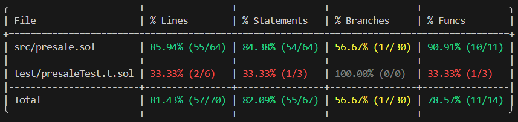

# Token Presale
## Overview 🪙
Run a presale of ERC20 tokens through 3 phases.
## Features 📃
* Presale begins in three phases. Each phase has a specific token quantity, price per token, and a fixed time limit.
* Purchase tokens using USDT or USDC. Note: For this occasion, these stable coins are represented using mock tokens.
* Purchase tokens using ETH. Note: For this occasion, the Arbitrum network was forked to obtain the current USD price of ETH using Chainlink data feeds.
* Once the presale is over, you can safely claim your tokens to the account from which you made the transaction.
## Technical details ⚙️
* Forked network for testing -> Arbitrum.
* RPC Server Address -> https://arb1.arbitrum.io/rpc.
* Uniswap V2 Swap Router Address (Arbitrum)-> 0x4752ba5DBc23f44D87826276BF6Fd6b1C372aD24.
* Uniswap Factory Address (Arbitrum) -> 0xf1D7CC64Fb4452F05c498126312eBE29f30Fbcf9.
* Framework CLI -> Foundry.
* Forge version -> 1.1.0-stable.
* Solidity compiler version -> 0.8.24.
## Deploying the contract 🛠️
1. Clone the GitHub repository.
2. Open Visual Studio Code (you should already have Foundry installed).
3. Select "File" > "Open Folder", select the cloned repository folder.
4. In the project navigation bar, open the "swapApp.t.sol" file located in the "test" folder.
5. On line 19 ("Address with USDC in Arbitrum Mainnet") enter the address of your wallet with USDC in the Arbitrum network. Note: Verify that you have at least 6 USDC on the Arbitrum network.
6. In the toolbar above, select "Terminal" > "New Terminal".
7. Select the "Git bash" terminal (previously installed).
8. Run the command `forge test -vvvv --fork-url https://arb1.arbitrum.io/rpc --match-test` followed by the name of a test function to test it and verify the smart contract functions are working correctly. For example, run `forge test -vvvv --fork-url https://arb1.arbitrum.io/rpc --match-test testHasBeenDeployedCorrectly` to test the `testHasBeenDeployedCorrectly` function.
9. Run `forge test -vvvv --fork-url https://arb1.arbitrum.io/rpc --match-test testSwapTokensCorrectly` to swap your 6 USDC for DAI. This is just a test on the forked Arbitrum network, so your USDC will remain in your wallet after this.
10. Run `forge test -vvvv --fork-url https://arb1.arbitrum.io/rpc --match-test testCanAddLiquidityCorrectly` to swap half of the USDC tokens. In this case, the contract takes 6 of your USDC, so a 3 USDC swap would be made. As a reward for providing liquidity to the USDC-DAI pool, you will be awarded Liquidity Provider Tokens.
11. Run `forge test -vvvv --fork-url https://arb1.arbitrum.io/rpc --match-test testCanRemoveLiquidityCorrectly` to redeem your Liquidity Provider Tokens for USDC and DAI from the liquidity pool.
12. Run `forge coverage --fork-url https://arb1.arbitrum.io/rpc` to generate a code coverage report, which allows you to verify which parts of the "swapApp.sol" script code (in the "src" folder) are executed by the tests. This helps identify areas outside the coverage that could be exposed to errors/vulnerabilities.
## Functions 📌
* `swapTokens()` -> Swap USDC for DAI.
* `addLiquidity()` -> Contribute USDC and DAI to the USDC-DAI liquidity pool to receive Liquidity Provider Tokens.
* `removeLiquidity()` -> Redeem your Liquidity Provider Tokens to receive USDC and DAI from the USDC-DAI liquidity pool.
## Testing functions ⌨️
* `testHasBeenDeployedCorrectly()` -> Verify that the swap app has been correctly initialized with the correct router address (`uniswapV2SwapRouterAddress`).
* `testSwapTokensCorrectly()` -> Verify that the 6 USDC to DAI swap was successful. Note: The amount of DAI you receive will vary depending on the liquidity in the USDC -> DAI liquidity pool.
* `testCanAddLiquidityCorrectly()` -> Verify that half of your USDC is swapped for DAI, that the USDC and DAI are contributed to the liquidity pool, and that you successfully obtain your Liquidity Provider Tokens.
* `testCanRemoveLiquidityCorrectly()` -> Verify that your Liquidity Provider Tokens are redeemed and that you are successfully receiving USDC and DAI from the liquidity pool.
## Forge Coverage ✅
  

CODE IS LAW!
